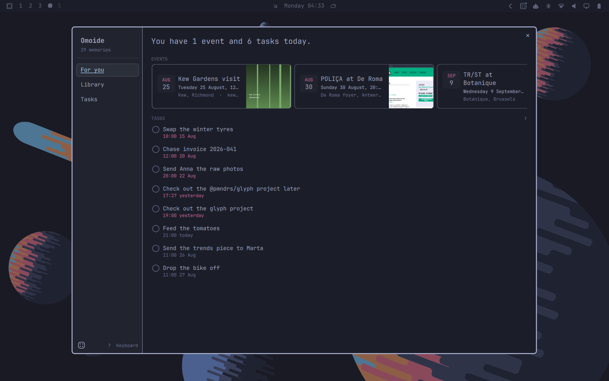

# Omoide

思い出 (*omoide*) is Japanese for a memory you keep.



More in [assets/](assets): the library, the capture menu, agent settings.

The idea is Nothing's, from
[Essential Space](https://nothing.community/d/44332-essential-space-everything-it-can-do)
on their phones. I wanted it on my computer, which is where I actually work, and
Omarchy's plugin system is what made that possible. Grab a screenshot, type a
note, or dictate one. An agent turns it into a memory with a title, a summary,
key facts, dates and to-dos.

Everything runs on your machine. No account, no server, nothing syncing. Your
memories are a SQLite file and a folder of images in your home directory. The
only thing that ever leaves is what you hand to a cloud agent, and nothing at
all if you run a local one.

## Demo

https://github.com/user-attachments/assets/f6019266-45bc-47b5-b1b4-4b8119e7e821

## Capturing

- **Left-click** the bar icon opens the menu.
- **Right-click** opens the library.

```text
screenshot ──▶ pick a region ──▶ overlay opens with the shot, note optional
note ────────▶ overlay opens empty, text required
voice ───────▶ overlay opens already listening, transcript lands editable
```

Enter saves. Esc discards the draft and its image. The button at the end of the
note field starts dictation in any mode, if Voxtype is installed.

## Browsing

One dialog, three views.

**For you** is today: a count of events and open tasks, then both lists.

**Library** is every capture, newest first, in a masonry grid. Agent tags filter
it. Search matches titles, notes, list items and OCR'd text, by prefix.

**Tasks** has three tabs, Upcoming, Past and Completed. Space ticks a row or
accepts a suggestion.

## Keyboard

The dialog works without a mouse. Ctrl 1 to 3 switch views, `/` searches, Space
ticks a task or accepts a suggestion, Enter opens what the cursor is on, Esc
steps back and then closes. `?` shows the full map.

## What a memory holds

A memory is an ordered list of typed blocks, and which blocks appear depends on
what you captured. An article gives you a source, a summary and key points. A
screenshot of a design board gives you an image and a list of names, nothing
more.

Headings, list items and to-dos are editable, so you can fix what the agent got
wrong. Related captures and collections are yours to link, never inferred.

## Tasks, events and reminders

Open any task or event to edit it: title, date, time, and as many reminders on
one item as you want. Nothing commits until Save, so closing the sheet drops a
mistyped date.

Reminders are armed inside the shell from the database, so they survive a
reboot and need nothing outside Omoide. One that came due while the machine was
off still arrives, if it is less than half an hour late.

Anything the agent inferred rather than being told arrives as a suggestion, a
bullet with a `+` and no alarm until you accept it.

## Install

```bash
omarchy plugin add https://github.com/leweyse/omoide.git --enable
```

It asks which bar section to put the icon in. The CLI runs on `python3`.
Screenshots need `grim` and `slurp`, OCR needs `tesseract`, dictation needs
`voxtype` (`omarchy-voxtype-install`).

To update, `omarchy plugin update leweyse.omoide`, then `omarchy restart
shell`. The shell rescans plugins on update but keeps rendering from its cached
QML until it restarts, so without one you are still running the old version.

To remove it, `omarchy plugin remove leweyse.omoide`. Your memories stay on
disk. Run `bin/omoide uninstall --purge` first if you want them gone with it.

For a keybinding, in `~/.config/hypr/bindings.lua`:

```lua
o.bind("SUPER + CTRL + <YOUR_CHOICE>", "Omoide capture",
       "omarchy-shell -q omoide capture screenshot")
```

## Choosing an agent

Presets cover claude, codex, opencode, gemini, ollama and aichat. `custom` takes
any command that reads the prompt on stdin and prints the answer on stdout.

Screenshots reach the agent as OCR text by default, so the image itself stays
here. "What the agent sees from a screenshot", in agent settings, switches that
to the screenshot itself, which reads charts and dense pages far better. Only
claude, codex, gemini and opencode take images, and the card says so for the
rest.

Presets run with their tools switched off, in an empty working directory: a
capture is a transcription of whatever was on screen, which can include a
paragraph written to be read by whatever handles it next, and these are coding
agents with a shell. Omoide passes each CLI's own flag for this, so claude gets
no tools, codex its shell tool switched off inside a read-only sandbox, gemini
its read-only mode, and opencode a deny-all permission set merged over your
config. `custom` is run exactly as you
wrote it, so add your agent's own read-only flag to the command yourself.

With no agent you still get the capture, your note, search over OCR'd text, and
a reminder from an explicit "remind me to call the vet tomorrow at 3pm".

## Where things live

```text
~/.config/omoide/config.json     the agent you chose
~/.local/share/omoide/           memories.db and blobs/, your captures
~/.local/state/omoide/           derived cache, rebuildable
```

Nothing else is written, and none of it is configurable: `XDG_*_HOME` moves the
base directory, but the `omoide/` leaf always comes from the plugin. That is
what makes `uninstall` safe to run — it can only delete a directory of its own
making, never a path it was handed.

## TODO list

**Voice dictation.** Voxtype does the transcription and the wiring is in, but I
have not put real use behind it. Next thing I want to fix.

**Export memories.** I still capture things on my Nothing phone and I want the
two halves to meet without a cloud account in between. The phone end is the part
I have not solved.

**Calendar integration.** Several providers, ideally, though it is low on my
list.

**Clipboard capture.** It already shows in the menu, disabled.

## License

MIT, in [LICENSE](LICENSE).
